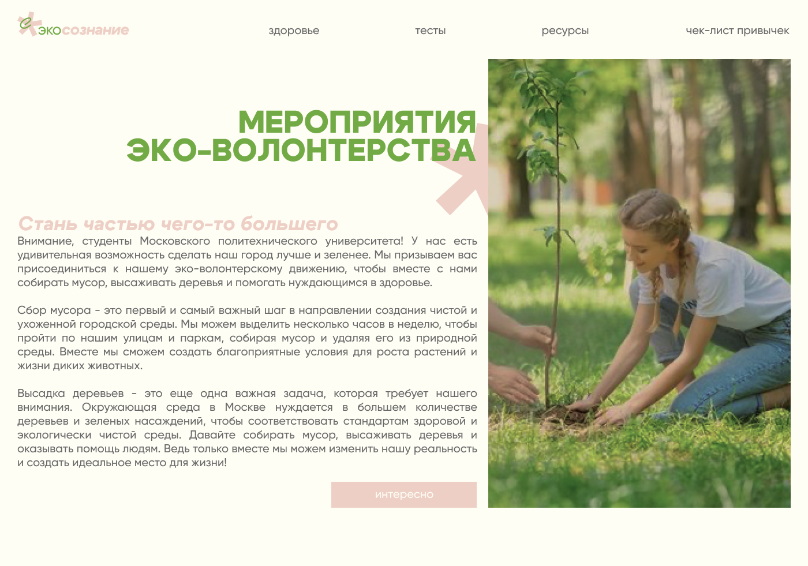
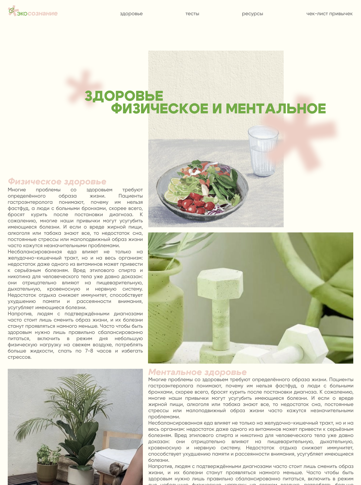
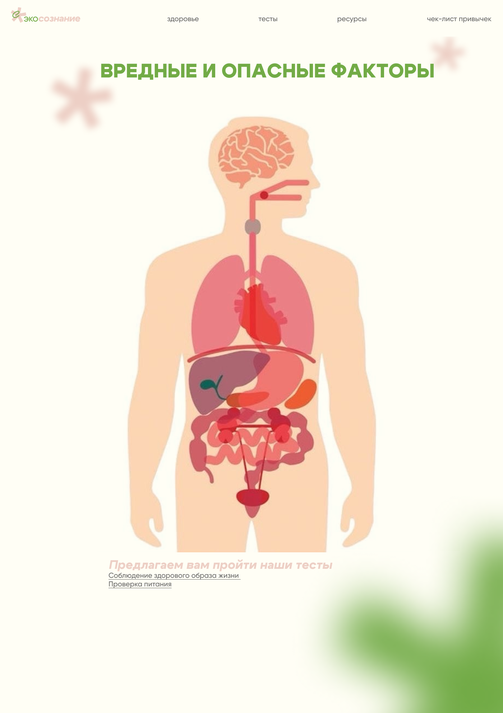

# Эко сознание 🍃🐸

Ниже иконкой ссылка на фигму проекта 
 

 
 

<h3>Расписал ваши задачки и примерные баллы</h3>

 | 📚 | georgerubaylo@gmail.com    | sidorov.andrey2005@mail.ru    | cfifeg1@gmail.com   | cfifeg1@gmail.com |
| :---:   | :---: | :---: | :---: |:---: |
| Задачи | 1   | 2    | 3   | 4   |
| Дата выполнения |    |    |    |    |
| Баллы | 5   | 5   | 5   |5   |
| Прошел код ревью |    |    |    |    |

<h3 style="font-weight: bold;">Задача 1</h3>
Верстка  фрейма "Волонтерство".
 

 
 
<h3 style="font-weight: bold;">Задача 2</h3>
Верстка  фрейма "Здоровье".
 

 
 
<h3 style="font-weight: bold;">Задача 3</h3>
Верстка  фрейма "Подборка ресурсов".
 

 
 
<h3 style="font-weight: bold;">Задача 4</h3>
Верстка  фрейма "Факторы".
 

 
